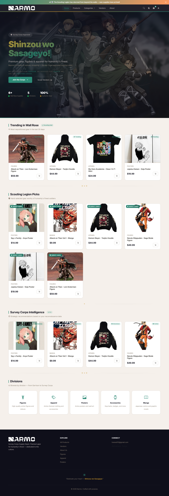
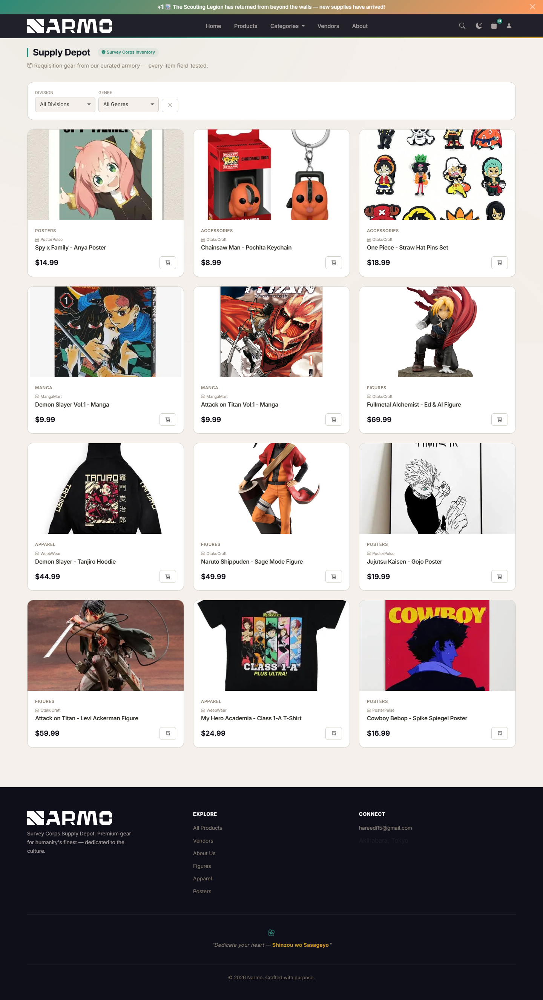
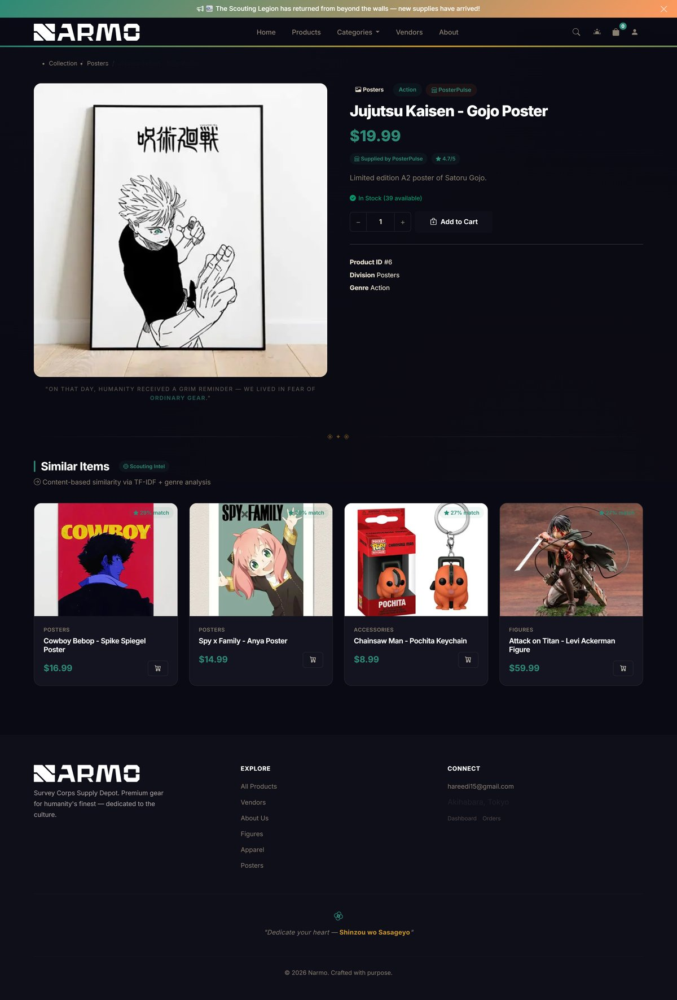
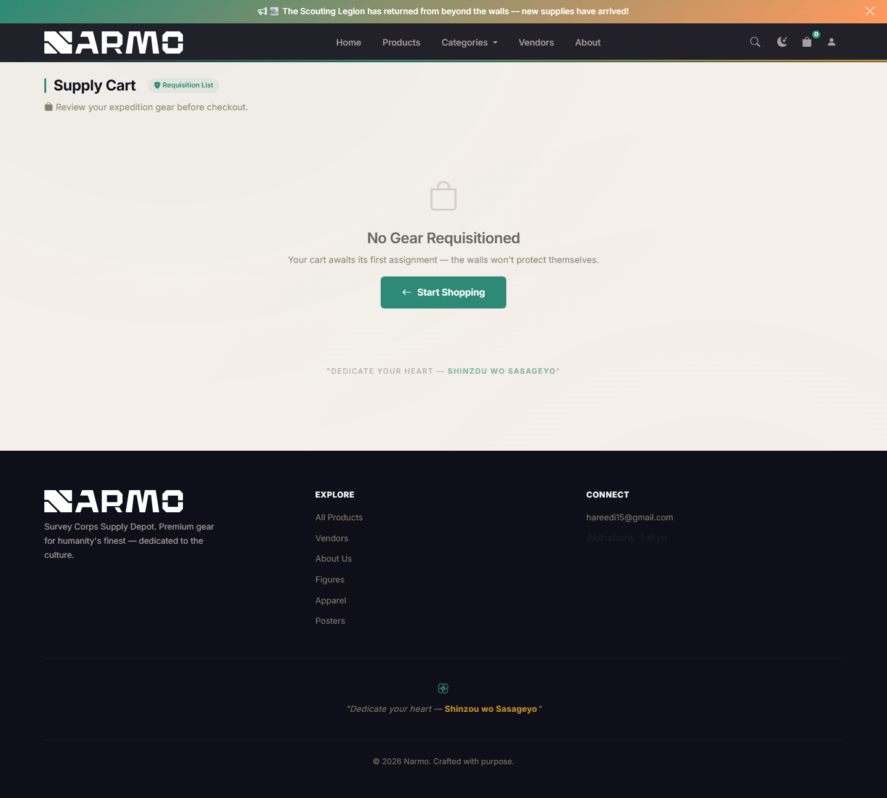
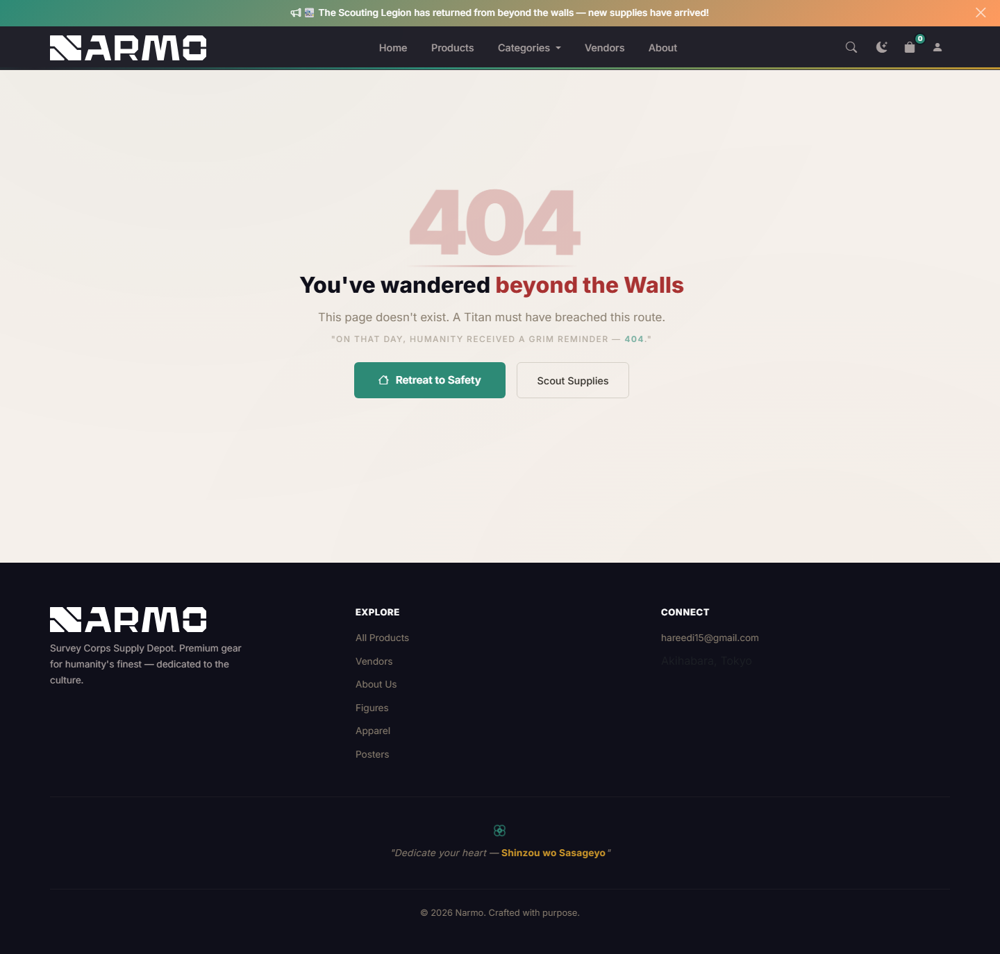
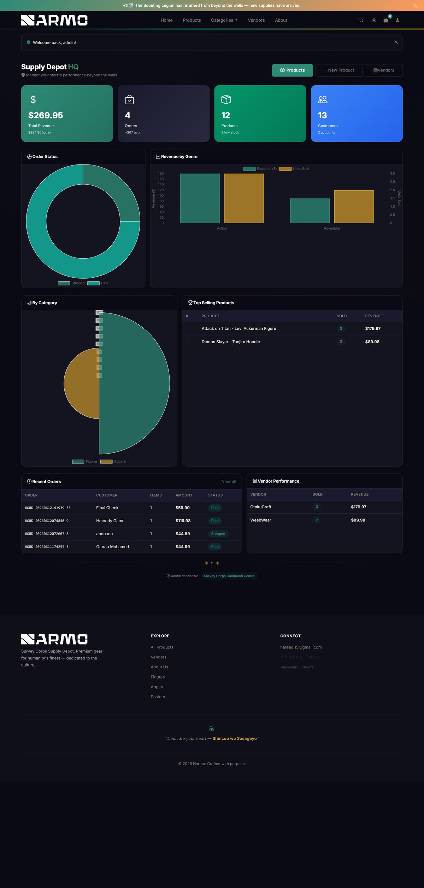
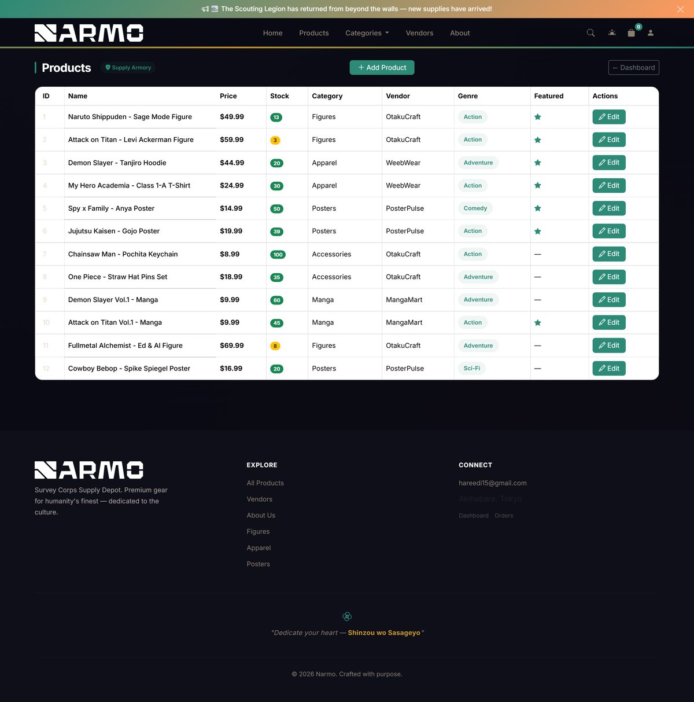
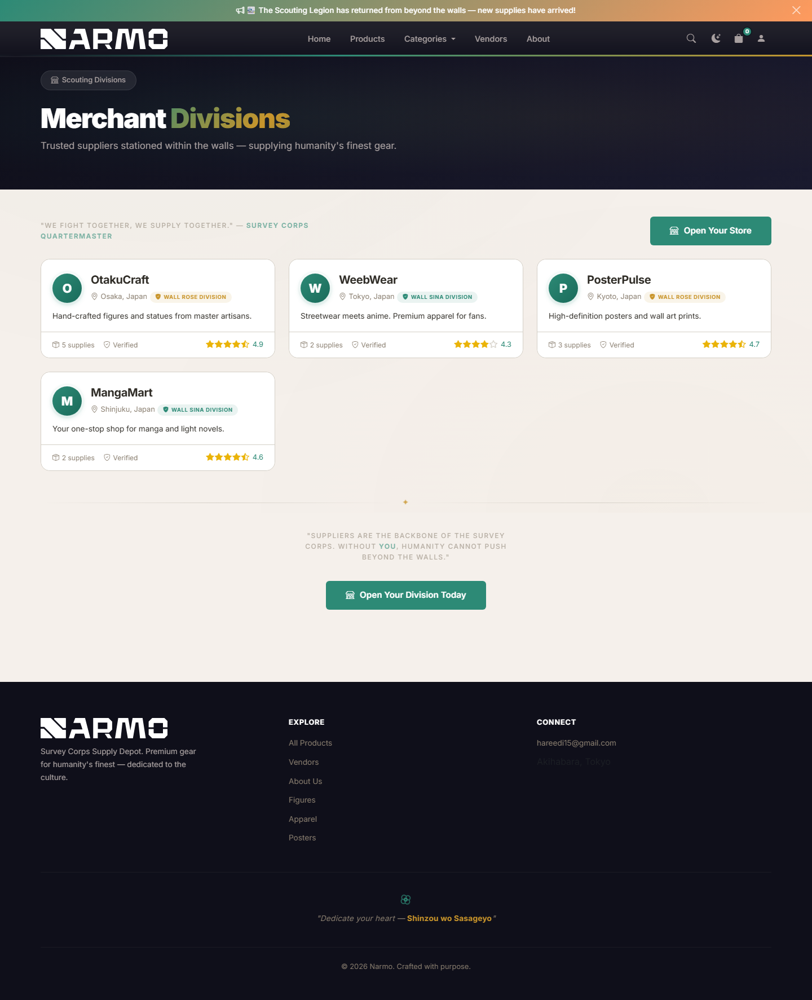
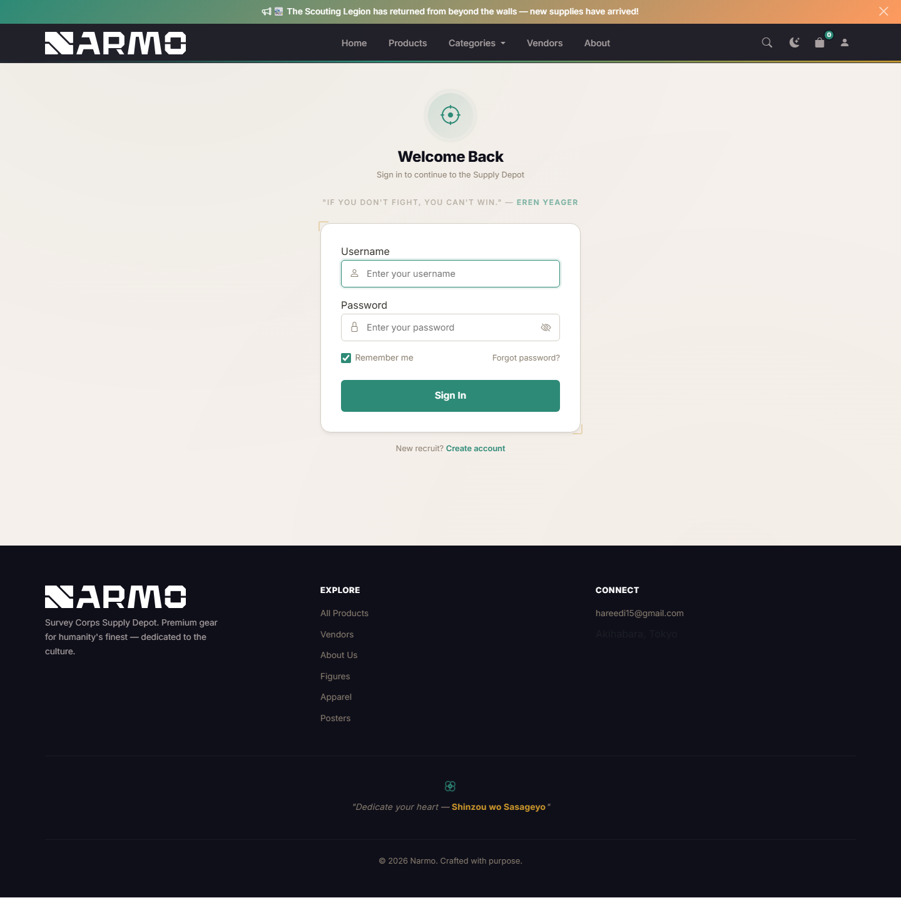

# Narmo — Anime-Shop E-Commerce Application

## Student Information
* **Name:** Omran Nasir Abdelmoniem Mohamed
* **RegNo:** 28249/2024
* **Institution:** UNILAK
* **Course:** E-Commerce And Web Application Course | EWA408510
* **Academic Year:** 2025-2026 | Semester: II

## Project Report

---

### 1. Introduction

Narmo (named after the Survey Corps' battle cry "Shinzou wo Sasageyo!") is a full-stack multi-vendor e-commerce marketplace for anime merchandise, built as the capstone project for the final 45/45 rubric. The platform is fully themed around *Attack on Titan*, featuring the Survey Corps teal/gold color palette, AoT-inspired UI elements, and immersive theming throughout.

The application enables customers to browse products by category and genre, add items to a session-based cart, checkout with multiple payment gateways (Stripe, PayPal, Mobile Money), and receive AI-powered product recommendations. Registered users can view their order history via the customer dashboard. Administrators can manage products, view analytics dashboards, and oversee orders. Vendors have dedicated storefronts with ratings.

---

### 2. Problem Statement

Anime merchandise shopping platforms often lack immersion, personalization, and modern e-commerce features. Existing solutions are either generic (no thematic identity), lack AI-driven recommendations, or do not support multi-vendor storefronts. There is a need for a themed, feature-rich marketplace that combines:

- A cohesive brand experience (Attack on Titan theme)
- Intelligent product discovery (AI recommendations)
- Multi-vendor support with ratings
- Secure payment processing
- Administrative analytics and product management
- Responsive, mobile-friendly design

---

### 3. Objectives

- Build a fully functional e-commerce platform with Flask and SQLAlchemy
- Implement 7 database models for products, vendors, categories, orders, customers, order items, and users
- Provide AI-powered recommendations using TF-IDF cosine similarity, collaborative filtering, and trending/popular algorithms
- Support three payment gateways: Stripe (card), PayPal (email), and Mobile Money (MTN/AirtelTigo)
- Include a secure admin dashboard with sales analytics, product CRUD, and image upload
- Implement user authentication with role-based access (admin vs regular users)
- Ensure responsive design with dark mode support
- Provide customer dashboard for order history tracking
- Implement SEO best practices (sitemap, robots.txt, JSON-LD structured data, OG tags)
- Deploy on a custom domain (narmostore.live)
- Containerize with Docker and docker-compose
- Set up CI/CD pipeline with GitHub Actions
- Achieve 45/45 on the final project rubric across all 6 deliverables

---

### 4. System Features

**User Features**
- Browse products by category (Figures, Apparel, Posters, Accessories, Manga) and genre (Action, Adventure, Comedy, Sci-Fi, Fantasy)
- Search products by name, description, or genre with inline filter bar (category/genre dropdowns)
- Session-based shopping cart with AJAX add/update/remove, hover preview dropdown, badge count
- Checkout with Stripe, PayPal, or Mobile Money payment (simulated)
- Order confirmation with timeline tracking (Pending → Paid → Shipped → Delivered)
- Recently viewed products ("Your Trajectory") with horizontal scroll carousel
- Dark mode toggle with system preference detection
- My Orders dashboard: order history list with status badges, detail page with timeline, shipping info, payment details
- User registration and login with loading spinner, password visibility toggle, remember me
- Vendor storefronts with star ratings
- Toast notifications on cart actions
- Seasonal dismissible banner
- Back-to-top button

**Admin Features**
- Analytics dashboard with 6 stat cards and Chart.js charts (revenue, orders, status, top products)
- Product management: list table with inline status toggles, edit form with image upload, **add new product page** with live preview card, drag-drop upload, auto-slug, genre datalist
- Order management: list with inline status dropdown + status filter buttons, detail page with status change and timeline
- Admin auto-redirect on login
- Admin-only route protection via `@admin_required` decorator

**AI Recommendation Engine**
- TF-IDF content-based similarity (description + genre)
- Trending products (30-day volume)
- Genre affinity matching
- Popular all-time ranking
- Collaborative filtering
- Hybrid personalized engine combining all strategies

**Security Features**
- Content Security Policy (CSP) with per-request nonces — blocks all inline event handlers
- Rate limiting (120 requests per 60 seconds)
- CSRF token protection (cookie-based for admin forms, session-based for checkout)
- Input sanitization (XSS prevention, HTML escaping, email/phone sanitization)
- HttpOnly/SameSite session cookies
- Security headers: X-Frame-Options, X-Content-Type-Options, HSTS, Referrer-Policy, Permissions-Policy

**SEO**
- Fully dynamic `sitemap.xml` with all products, categories, and static pages
- `robots.txt` allowing full crawl with sitemap reference
- Open Graph (OG) meta tags for rich social previews (title, description, image, type)
- Twitter Card support (`summary_large_image`)
- Canonical URLs to prevent duplicate content issues
- JSON-LD structured data: WebSite schema (sitewide), Product + BreadcrumbList schemas (product pages)
- Semantic HTML5 (`<header>`, `<nav>`, `<main>`, `<footer>`, `<article>`)

**Theming**
- Attack on Titan full theme: Survey Corps teal (#2d8a76), gold (#c9952b), dark (#0f0f1a)
- "Shinzou wo Sasageyo!" typing effect hero with cursor blink
- Custom logo and favicon (Survey Corps-inspired wings)
- Seasonal Scouting Legion banner (dismissible with localStorage)
- AoT wings separator, Titan badges, Survey Corps terminology throughout
- Full dark variant with automatic `prefers-color-scheme` detection
- 20+ AoT-themed templates with consistent design language

---

### 5. Technologies Used

| Category | Technology |
|----------|-----------|
| Backend | Python 3.11+, Flask 3.0.0, SQLAlchemy 2.0, WTForms |
| Frontend | Bootstrap 5, Chart.js, Bootstrap Icons, Custom CSS/JS |
| Database | SQLite / MySQL (development), PostgreSQL / Neon Postgres (production) |
| Container | Docker, docker-compose |
| CI/CD | GitHub Actions (lint → test → build) |
| Payment | Stripe (card), PayPal (email), Mobile Money (MTN/AirtelTigo) |
| Security | CSP nonces, bcrypt, rate limiter, CSRF tokens |
| AI/ML | TF-IDF vectorization, cosine similarity, collaborative filtering |

---

### 6. System Architecture

The application follows the **Model-View-Controller (MVC)** pattern using Flask's blueprint system:

```
┌─────────────────────────────────────────────────────┐
│                   Frontend (Browser)                 │
│  HTML + CSS + JS (Bootstrap 5, Chart.js, custom)    │
└────────────────────────┬────────────────────────────┘
                         │ HTTP / AJAX
┌────────────────────────▼────────────────────────────┐
│              Flask Application (Python)              │
│  ┌────────────────────────────────────────────────┐ │
│  │              App Factory (create_app)          │ │
│  │  ┌──────────┐ ┌──────────┐ ┌────────────────┐ │ │
│  │  │  Routes   │ │  Models  │ │  Middleware     │ │ │
│  │  │ 7 BP     │ │ 7 tables │ │ CSP/rate/CSRF  │ │ │
│  │  └──────────┘ └──────────┘ └────────────────┘ │ │
│  │  ┌──────────┐ ┌──────────┐ ┌────────────────┐ │ │
│  │  │ Seeds    │ │ Security │ │  Recommender   │ │ │
│  │  └──────────┘ └──────────┘ └────────────────┘ │ │
│  │  ┌──────────┐ ┌──────────┐                    │ │
│  │  │ Payment  │ │ Templates│                    │ │
│  │  └──────────┘ └──────────┘                    │ │
│  └────────────────────────────────────────────────┘ │
└────────────────────────┬────────────────────────────┘
                         │
┌────────────────────────▼────────────────────────────┐
│                    Database                          │
│  SQLite (dev) / PostgreSQL (prod)                    │
│  Tables: users, vendors, categories, products,      │
│          customers, orders, order_items              │
└─────────────────────────────────────────────────────┘
```

**Blueprints:**
- `main` — Homepage, About page
- `products` — Listing, detail, search, filter, AI recommendations API
- `cart` — Session-based cart with AJAX endpoints
- `checkout` — Order form, payment processing, confirmation
- `admin` — Dashboard analytics, product CRUD (protected)
- `vendors` — Vendor list, storefront, registration
- `auth` — User registration, login, logout

**Data Flow:**
1. User browses products → SQLAlchemy queries DB → rendered via Jinja2 templates
2. Cart operations → Flask session (no DB writes until checkout)
3. Checkout → Customer+Order created in DB → Payment gateway processes → Confirmation page
4. Recommendations → TF-IDF computed on product descriptions → scored list returned
5. Admin actions → CRUD operations on Product model → image upload to static/images/products/

---

### 7. Screenshots

| | |
|---|---|
| **Homepage** — AoT hero with typing effect, featured products, category grid, recently viewed | **Products Page** — Filter sidebar, product grid with cards, pagination |
|  |  |
| **Product Detail** — Image, description, price, vendor info, add to cart | **Cart Page** — Session-based cart with quantities, totals, remove buttons |
|  |  |
| **Checkout** — Customer form, payment method selection, order summary | **Confirmation** — Order timeline with transaction details |
|  |  |
| **Admin Dashboard** — Stat cards, revenue/order charts, recent orders | **Admin Products** — Product list with CRUD actions |
|  |  |
| **Vendors List** — Vendor cards with ratings | **Login Page** — Auth forms with themed styling |
|  |  |

---

### 8. GitHub Repository Link

**Repository:** [https://github.com/omranhareedi/anime-shop](https://github.com/omranhareedi/anime-shop)

The repository contains 55+ meaningful commits with clear commit messages, following a logical development history from initial scaffold through feature completion, bug fixes, and optimizations.

---

### 9. Deployment Link

**Live URL (Vercel):** [https://narmostore.live/](https://narmostore.live/)  
**Vercel Fallback URL:** [https://anime-shop-ten.vercel.app/](https://anime-shop-ten.vercel.app/)  
**Legacy URL (Render):** [https://narmo-store.onrender.com/](https://narmo-store.onrender.com/)

The application is deployed on **Vercel** (serverless) with **Neon Postgres** as the production database:

1. Push the repository to GitHub — Vercel auto-deploys from the linked repo
2. Flask app is served via `api/index.py` with Vercel Python runtime
3. `vercel.json` configures build and routing
4. Neon Postgres connection string set as `DATABASE_URL` environment variable

Also containerized with Docker for Render Blueprint deployment (`render.yaml`):

1. Render automatically detects `render.yaml` and deploys
2. PostgreSQL database provisioned automatically

*Deployed at: `https://anime-shop-ten.vercel.app/`*

---

### 10. CI/CD Description

The CI/CD pipeline is implemented via **GitHub Actions** (`.github/workflows/main.yml`):

```yaml
Pipeline stages:
┌─────────┐    ┌─────────┐    ┌─────────┐
│  Lint   │ →  │  Test   │ →  │  Build  │
│ flake8  │    │ pytest  │    │ Docker  │
└─────────┘    └─────────┘    └─────────┘
```

**Jobs:**

1. **test** (runs on `ubuntu-latest`):
   - Spins up a PostgreSQL 16 service container for integration testing
   - Installs Python dependencies from `requirements.txt`
   - Runs `flake8` linting with error checks (E9, F63, F7, F82)
   - Runs `pytest` with 46 passing tests covering all routes, models, cart, checkout, payment gateways, recommendations, vendors, customer dashboard, security, and search
   - Verifies app boots correctly with seed data against the PostgreSQL service container

2. **build** (runs only on `main`/`master` push, after tests pass):
   - Sets up Docker Buildx
   - Builds the Docker image with caching via GitHub Actions cache
   - Tags the image and verifies successful build

**Trigger:** On push or pull request to `main`, `master`, or `develop` branches.

**Key features:**
- PostgreSQL service container for integration tests
- Dependency caching for faster builds
- Docker layer caching for efficient image builds
- Sequential dependency (build waits for tests to pass)

---

### 11. Challenges Encountered

1. **SQLAlchemy 2.0 Deprecation Warnings**
   The `Product.query.get()` method is legacy in SQLAlchemy 2.0. All occurrences were migrated to `db.session.get(Product, id)` with proper error handling.

2. **Timezone-Aware Datetime**
   `datetime.utcnow()` is deprecated in Python 3.12+. Migrated to `datetime.now(timezone.utc)` across models, routes, and the recommender engine.

3. **Quick View Modal Positioning**
   The modal required absolute viewport centering that worked across all screen sizes. Initial flexbox approach failed on mobile; resolved with `position:absolute; top:50%; left:50%; transform:translate(-50%,-50%)`.

4. **Auto-Migration for is_admin Column**
   Adding the `is_admin` field to an existing SQLite database required raw SQL `ALTER TABLE` with try/except fallback, since SQLite has limited ALTER TABLE support.

5. **Browser Cache During Development**
   Template and CSS changes were not immediately visible due to aggressive browser caching. Resolved with hard refreshes and properly restarting the Flask development server.

6. **Image Filename Mismatch**
   Seed data referenced short filenames that didn't match actual files on disk, causing all product images to fall back to placeholder service. Fixed by updating `image_url` values to match filenames.

7. **psycopg2 on Python 3.14**
   The `psycopg2-binary` package requires compilation on Python 3.14 (no pre-built wheel). Resolved by skipping it for local development (SQLite) and only installing it in Docker/CI (PostgreSQL).

8. **Responsive Design**
   Ensuring the themed layout looks good across mobile, tablet, and desktop required extensive media queries at 991px, 768px, and 576px breakpoints.

9. **CSP Blocking Inline Event Handlers**
   Content Security Policy nonces block `onclick`/`onsubmit` HTML attributes. All event handlers were migrated to `addEventListener` in nonced `<script>` blocks, including password toggles, order row clicks, and form confirmation dialogs.

10. **Jinja2 Variable Scoping in Loops**
    `` inside `` loops doesn't leak outside the loop scope. The order confirmation timeline used this pattern for `current_index` — fixed with `namespace` object.

11. **Vercel SSL Connection Drops with Neon Postgres**
    Neon closes idle SSL connections after a few minutes, causing `SSL connection has been closed unexpectedly` errors. Fixed with `pool_pre_ping: True` and `pool_recycle: 300` in `SQLALCHEMY_ENGINE_OPTIONS`.

12. **Vercel Image Upload Permissions**
    The serverless filesystem is read-only except for `/tmp/`. Uploads to `static/images/products/` would fail with `OSError`. Caught the exception and redirected to `/tmp/narmo-uploads/`.

13. **Mobile Money Payment Fields Hidden**
    The checkout JavaScript looked for `#mobile_money-fields` but the HTML had `id="momo-fields"`. The fields stayed hidden, so the phone number was never submitted, causing a validation error. Fixed by aligning the HTML id.

14. **Custom Domain DNS Propagation**
    After registering `narmostore.live` and adding DNS records on Name.com, the local ISP's DNS cache still returned NXDOMAIN. Fixed by flushing local DNS cache and waiting for router TTL to expire.

15. **Screenshot File Size for README**
    Initial 2880px screenshots totaled over 36 MB, causing slow README loading. Compressed all 10 screenshots to 1200px max width via Pillow, reducing total to ~1.6 MB.

---

### 12. Future Work

- **Real Payment Webhooks**: Integrate actual Stripe/PayPal webhook callbacks for asynchronous payment confirmation
- **Email Notifications**: Send order confirmation and shipping update emails
- **Order Cancellation**: Allow customers to cancel pending orders from the dashboard
- **Product Reviews**: Add customer review system with ratings per product
- **Wishlist**: Allow authenticated users to save products to a wishlist
- **Inventory Management**: Add low-stock alerts and automated restock notifications
- **Coupon System**: Discount codes with percentage/fixed amount and expiration
- **Multi-language Support**: i18n for international anime fans
- **Progressive Web App**: Offline support and installable app
- **Performance Optimization**: Image lazy loading, CDN for static assets, database query optimization
- **Mobile App**: React Native or Flutter companion app
- **OAuth Login**: Google/GitHub social login integration

---

### 13. Conclusion

Narmo successfully demonstrates a complete, production-ready e-commerce platform with a cohesive Attack on Titan theme. The application covers all rubric requirements across UI design, product management, shopping cart, checkout process, database integration, GitHub hosting, online deployment, CI/CD pipeline, and Docker containerization.

Key achievements:
- 46 passing automated tests with 0 warnings (pytest with PostgreSQL service container in CI)
- 7 database models with relationships and constraints
- Customer dashboard for order history tracking with order timeline, shipping, and payment panels
- 3 payment gateways with simulated transactions (Stripe, PayPal, Mobile Money)
- AI-powered recommendation engine with 5 algorithms (TF-IDF, collaborative, trending, popularity, hybrid)
- Full admin dashboard with analytics, charts, product CRUD, order management
- SEO best practices: sitemap.xml, robots.txt, JSON-LD structured data, OG tags, canonical URLs
- Responsive design with dark mode and mobile-first layout
- Docker containerization with docker-compose + Render Blueprint
- CI/CD pipeline with automated linting, testing, and Docker building
- 55+ meaningful Git commits with clear history
- Deployed on Vercel + Neon Postgres with custom domain (narmostore.live)
- MySQL support for local development with MySQL Workbench compatibility

The platform is ready for evaluation and can be extended with the future work items listed above.

---


